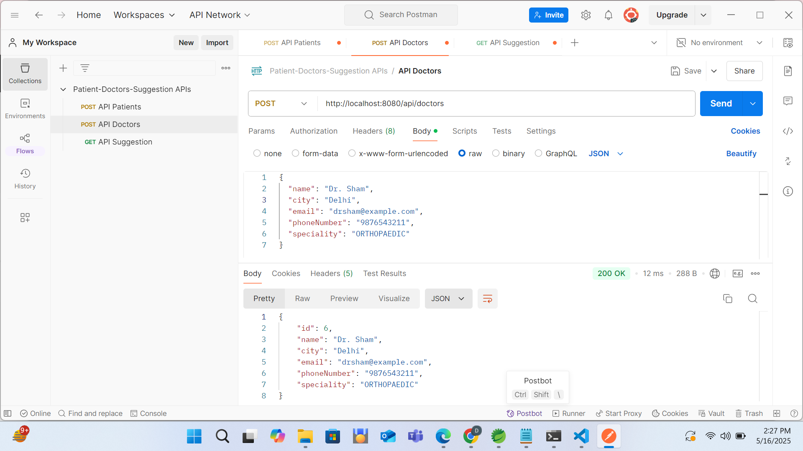
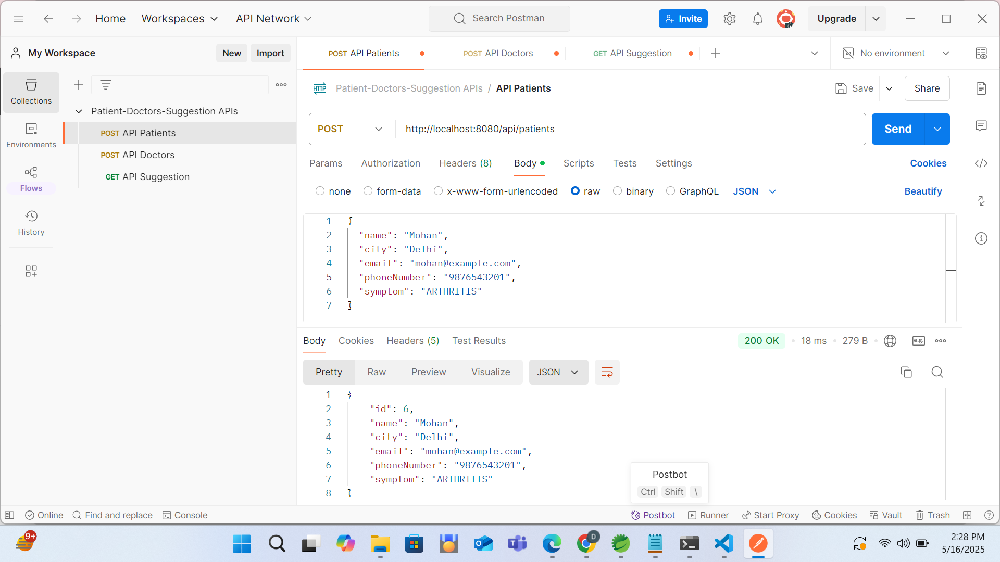
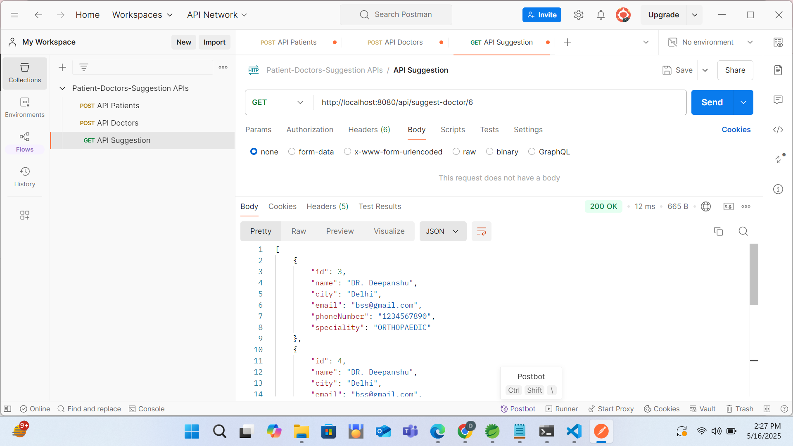
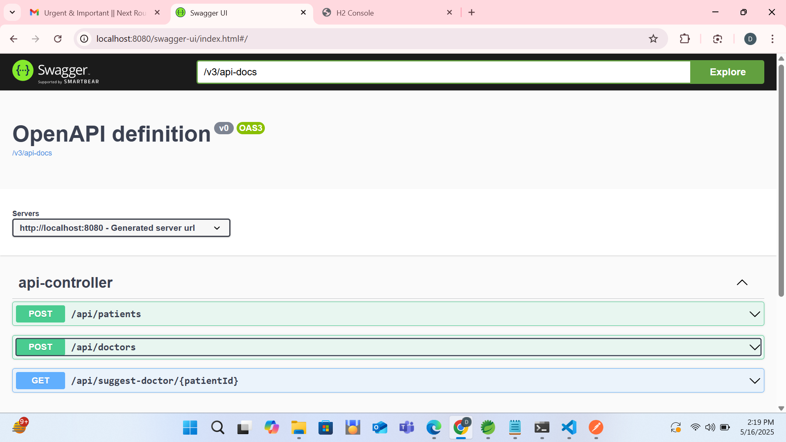

# 🏥 Doctor-Patient Suggestion API

A Spring Boot 3 based REST API that allows doctors to register, patients to be added with symptoms, and suggests appropriate doctors based on patient symptoms and location.

---

## 📌 Project Features

- ✅ Add Doctor with name, city, email, phone, and speciality
- ✅ Add Patient with name, city, email, phone, and symptom
- ✅ Suggest doctors based on patient's symptom and city
- ✅ Edge case handling for unsupported cities or unavailable doctors
- ✅ Input validations on all fields
- ✅ Swagger UI for API documentation
- ✅ In-memory H2 database


## 🚀 How to Run the Project

### 🛠️ Requirements

- Java 17+
- Maven
- IntelliJ or Eclipse (recommended)

### ▶️ Run Steps

```bash
# 1. Clone the repository
git clone https://github.com/ambermittal/doctor-patient-suggestion-api.git
cd doctor-patient-suggestion

# 2. Run using Maven
./mvnw spring-boot:run
```

If successful, the app will start at:

```
http://localhost:8080
```

---

## 🌐 API Documentation (Swagger)

Visit:

```
http://localhost:8080/swagger-ui.html
```

All APIs will be listed with request/response examples.

---

## 📮 API Endpoints

| Method | Endpoint                          | Description                             |
|--------|-----------------------------------|-----------------------------------------|
| POST   | `/api/doctors`                    | Add a doctor                            |
| POST   | `/api/patients`                   | Add a patient                           |
| GET    | `/api/suggest-doctor/{patientId}` | Suggest doctor based on symptom & city |

---

## 📬 Sample API Requests

### ➕ Add Doctor

**POST** `/api/doctors`

```json
{
  "name": "Dr. Sharma",
  "city": "Delhi",
  "email": "drsharma@example.com",
  "phoneNumber": "9876543210",
  "speciality": "ORTHOPAEDIC"
}
```

### ➕ Add Patient

**POST** `/api/patients`

```json
{
  "name": "John",
  "city": "Delhi",
  "email": "john@example.com",
  "phoneNumber": "9876543211",
  "symptom": "ARTHRITIS"
}
```

### 🧠 Suggest Doctor

**GET** `/api/suggest-doctor/1`

**Expected Response:**

```json
[
  {
    "id": 1,
    "name": "Dr. Sharma",
    "city": "Delhi",
    "email": "drsharma@example.com",
    "phoneNumber": "9876543210",
    "speciality": "ORTHOPAEDIC"
  }
]
```

---

## ⚠️ Edge Case Responses

### ❌ Unsupported City

```json
{
  "message": "We are still waiting to expand to your location"
}
```

### ❌ No Doctor for Symptom

```json
{
  "message": "There isn’t any doctor present at your location for your symptom"
}
```

---

## 🔒 Validation Rules

| Field         | Rule                                |
|---------------|-------------------------------------|
| Name          | Minimum 3 characters                |
| City          | Maximum 20 characters               |
| Email         | Valid email format                  |
| Phone Number  | At least 10 digits                  |
| Doctor City   | Only: Delhi, Noida, Faridabad       |
| Speciality    | ORTHOPAEDIC, GYNECOLOGY, DERMATOLOGY, ENT |
| Symptom       | See table below                     |

---

## 🧠 Symptom to Speciality Mapping

| Symptom         | Mapped Speciality |
|-----------------|------------------|
| Arthritis       | ORTHOPAEDIC      |
| Back Pain       | ORTHOPAEDIC      |
| Tissue Injuries | ORTHOPAEDIC      |
| Dysmenorrhea    | GYNECOLOGY       |
| Skin Infection  | DERMATOLOGY      |
| Skin Burn       | DERMATOLOGY      |
| Ear Pain        | ENT              |

---

## 📂 Project Structure

```
src/
├── controller/
│   └── ApiController.java
├── entity/
│   ├── Doctor.java
│   ├── Patient.java
│   ├── Speciality.java
│   └── Symptom.java
├── repository/
│   ├── DoctorRepository.java
│   └── PatientRepository.java
├── service/
│   └── SuggestionService.java
└── DoctorPatientApplication.java
```

---

## 🧪 Postman Collection

A Postman collection is included in the `/postman/` folder:

```
postman/doctor-patient-suggestion.postman_collection.json
```

You can import it into Postman and test all endpoints easily.

---

## 📸 API Screenshots

**API-Doctors**:



**API-Patients**:



**API-Suggestion**:



**Swagger APIs**:



---

## 📊 View H2 Console (In-Memory DB)

Visit:

```
http://localhost:8080/h2-console
```

Use:

- **JDBC URL**: `jdbc:h2:mem:clinicdb`
- **Username**: `sa`
- **Password**: *(leave blank)*

---